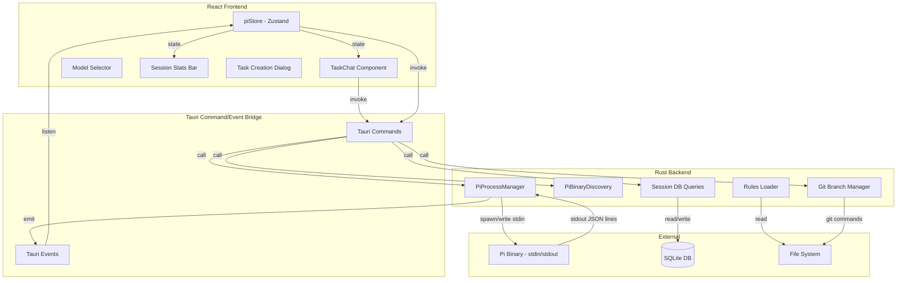
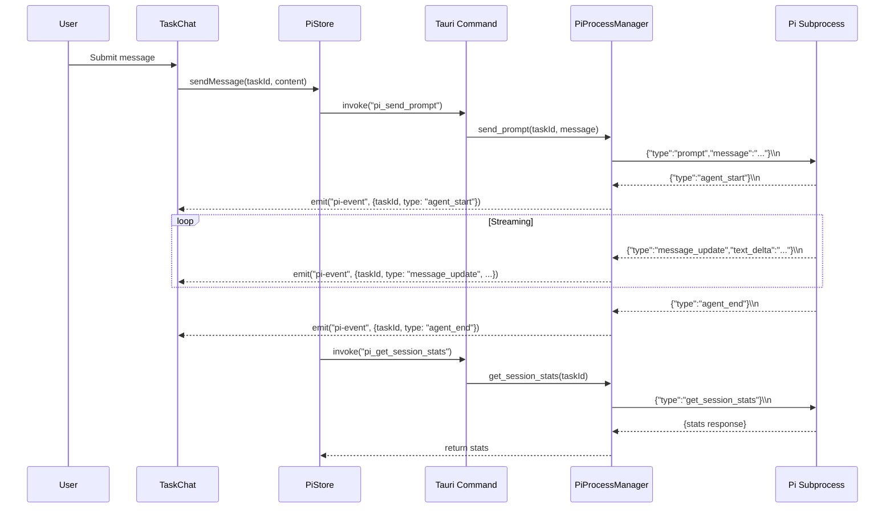

# Design Document: Pi Dev Integration

## Overview

This design replaces Akira's multi-provider CLI Router architecture with a single Pi (pi.dev) integration using its JSON-over-stdin/stdout RPC protocol. The refactored system spawns one Pi subprocess per task from the Rust backend, streams events to the React frontend via Tauri event emission, and removes all legacy Engine, MCP, Skills, and Router modules.

The architecture follows a three-layer pattern:

1. **Rust Backend** — Pi process lifecycle, RPC serialization, session persistence, binary discovery
2. **Tauri Bridge** — Commands (frontend → backend) and Events (backend → frontend)
3. **React Frontend** — Zustand stores for Pi state, streaming chat UI, model selection, session stats

### Key Design Decisions

- **One Pi subprocess per task**: Simplifies session isolation and avoids multiplexing complexity. Pi manages its own conversation history internally.
- **Stdin/stdout JSON lines**: No HTTP server, no WebSocket — direct pipe communication for lowest latency.
- **Session files managed by Pi**: Akira stores only the session ID reference; Pi owns the session data on disk.
- **Tauri events for streaming**: Backend reads stdout line-by-line and emits typed Tauri events. Frontend subscribes per-task.
- **No API key management**: Pi handles its own auth via `~/.pi/agent/auth.json`. Akira only verifies auth status.

## Architecture



### Event Flow (Streaming Response)



## Components and Interfaces

### Rust Backend Components

#### 1. PiBinaryDiscovery

Responsible for locating and validating the Pi binary at application startup.

```rust
pub struct PiBinaryDiscovery;

impl PiBinaryDiscovery {
    /// Search for pi binary in priority order:
    /// 1. System PATH
    /// 2. ~/.pi/bin
    /// 3. /usr/local/bin
    /// 4. ~/.local/bin
    pub fn discover() -> Result<PathBuf, PiDiscoveryError>;

    /// Verify the binary at path is executable
    fn verify_executable(path: &Path) -> Result<(), PiDiscoveryError>;
}

pub enum PiDiscoveryError {
    NotFound { searched_locations: Vec<String> },
    NotExecutable { path: PathBuf },
}
```

#### 2. PiProcessManager

Manages Pi subprocess lifecycle — spawning, communication, and termination. Holds a map of task_id → active Pi process.

```rust
pub struct PiProcess {
    child: Child,
    stdin: ChildStdin,
    stdout_task: JoinHandle<()>,
    task_id: String,
    session_id: Option<String>,
}

pub struct PiProcessManager {
    processes: Arc<Mutex<HashMap<String, PiProcess>>>,
    pi_binary_path: PathBuf,
    app_handle: AppHandle,
}

impl PiProcessManager {
    pub fn new(pi_binary_path: PathBuf, app_handle: AppHandle) -> Self;

    /// Spawn a Pi subprocess for a task. Sets cwd to workspace path.
    /// Args: --mode rpc --no-session (or --session <id> for resume)
    pub async fn spawn(&self, task_id: &str, cwd: &Path, session_id: Option<&str>) -> Result<(), PiError>;

    /// Send a JSON command to the Pi process for a given task
    pub async fn send_command(&self, task_id: &str, command: PiCommand) -> Result<(), PiError>;

    /// Send abort command with priority (bypasses pending writes)
    pub async fn send_abort(&self, task_id: &str) -> Result<(), PiError>;

    /// Gracefully terminate a Pi process: close stdin, wait 5s, SIGKILL
    pub async fn terminate(&self, task_id: &str) -> Result<(), PiError>;

    /// Terminate all active processes (app shutdown). 3s timeout before SIGKILL.
    pub async fn terminate_all(&self);

    /// Check if a process is running for a task
    pub fn is_running(&self, task_id: &str) -> bool;
}
```

#### 3. PiCommand / PiEvent Types

```rust
#[derive(Serialize)]
#[serde(tag = "type")]
pub enum PiCommand {
    #[serde(rename = "prompt")]
    Prompt { message: String },
    #[serde(rename = "get_available_models")]
    GetAvailableModels,
    #[serde(rename = "set_model")]
    SetModel { model: String },
    #[serde(rename = "get_state")]
    GetState,
    #[serde(rename = "get_session_stats")]
    GetSessionStats,
    #[serde(rename = "abort")]
    Abort,
    #[serde(rename = "steer")]
    Steer { message: String },
    #[serde(rename = "follow_up")]
    FollowUp { message: String },
    #[serde(rename = "new_session")]
    NewSession,
    #[serde(rename = "compact")]
    Compact,
}

#[derive(Deserialize, Clone)]
#[serde(tag = "type")]
pub enum PiEvent {
    #[serde(rename = "agent_start")]
    AgentStart,
    #[serde(rename = "agent_end")]
    AgentEnd { /* optional fields */ },
    #[serde(rename = "message_update")]
    MessageUpdate {
        text_delta: Option<String>,
        thinking_delta: Option<String>,
        toolcall_delta: Option<String>,
    },
    #[serde(rename = "tool_execution_start")]
    ToolExecutionStart { tool_name: String },
    #[serde(rename = "tool_execution_update")]
    ToolExecutionUpdate { status: String },
    #[serde(rename = "tool_execution_end")]
    ToolExecutionEnd { tool_name: String, success: bool, result: Option<String> },
    #[serde(rename = "compaction_start")]
    CompactionStart,
    #[serde(rename = "compaction_end")]
    CompactionEnd,
    #[serde(rename = "auto_retry_start")]
    AutoRetryStart,
    #[serde(rename = "auto_retry_end")]
    AutoRetryEnd,
    #[serde(rename = "models_response")]
    ModelsResponse { models: Vec<PiModel>, active: String },
    #[serde(rename = "session_stats")]
    SessionStats { tokens_used: u64, context_window_pct: f64 },
    #[serde(rename = "error")]
    Error { message: String, code: Option<String> },
}

#[derive(Deserialize, Serialize, Clone)]
pub struct PiModel {
    pub id: String,
    pub name: String,
    pub provider: String,
}
```

#### 4. Tauri Commands

```rust
// Pi lifecycle
#[tauri::command]
async fn pi_discover_binary(state: State<'_, AppState>) -> Result<String, String>;

#[tauri::command]
async fn pi_check_auth(state: State<'_, AppState>) -> Result<PiAuthStatus, String>;

#[tauri::command]
async fn pi_spawn(state: State<'_, AppState>, task_id: String, workspace_path: String, session_id: Option<String>) -> Result<(), String>;

#[tauri::command]
async fn pi_terminate(state: State<'_, AppState>, task_id: String) -> Result<(), String>;

// Pi RPC commands
#[tauri::command]
async fn pi_send_prompt(state: State<'_, AppState>, task_id: String, message: String) -> Result<(), String>;

#[tauri::command]
async fn pi_send_steer(state: State<'_, AppState>, task_id: String, message: String) -> Result<(), String>;

#[tauri::command]
async fn pi_abort(state: State<'_, AppState>, task_id: String) -> Result<(), String>;

#[tauri::command]
async fn pi_get_models(state: State<'_, AppState>, task_id: String) -> Result<(), String>;

#[tauri::command]
async fn pi_set_model(state: State<'_, AppState>, task_id: String, model: String) -> Result<(), String>;

#[tauri::command]
async fn pi_get_session_stats(state: State<'_, AppState>, task_id: String) -> Result<(), String>;

#[tauri::command]
async fn pi_new_session(state: State<'_, AppState>, task_id: String) -> Result<String, String>;

#[tauri::command]
async fn pi_compact(state: State<'_, AppState>, task_id: String) -> Result<(), String>;

// Session management
#[tauri::command]
async fn pi_get_task_session(state: State<'_, AppState>, task_id: String) -> Result<Option<String>, String>;

#[tauri::command]
async fn pi_create_task_session(state: State<'_, AppState>, task_id: String, session_id: String) -> Result<(), String>;

// Git branch workflow
#[tauri::command]
async fn pi_create_task_branch(state: State<'_, AppState>, task_id: String, base_branch: String, task_title: String, cwd: String) -> Result<String, String>;

#[tauri::command]
async fn pi_checkout_task_branch(state: State<'_, AppState>, task_id: String, cwd: String) -> Result<(), String>;

// Rules
#[tauri::command]
async fn pi_get_rules(state: State<'_, AppState>, workspace_path: String) -> Result<Option<String>, String>;
```

#### 5. Updated AppState

```rust
pub struct AppState {
    pub db: Arc<Mutex<rusqlite::Connection>>,
    pub pi_manager: Arc<PiProcessManager>,
    pub pi_binary_path: Arc<Mutex<Option<PathBuf>>>,
    pub pty_manager: Arc<std::sync::RwLock<PtyManager>>,
}
```

### Frontend Components

#### 1. piStore (Zustand)

```typescript
interface PiSessionState {
  sessionId: string | null;
  isStreaming: boolean;
  messages: PiChatMessage[];
  currentThinking: string;
  toolExecutions: ToolExecution[];
  sessionStats: SessionStats | null;
  error: string | null;
}

interface PiStoreState {
  // Global state
  piStatus: 'disconnected' | 'verifying' | 'connected' | 'auth_error' | 'error';
  piError: string | null;
  availableModels: PiModel[];
  activeModel: string | null;
  persistedModel: string | null;

  // Per-task state
  taskSessions: Record<string, PiSessionState>;

  // Task creation session
  taskCreationSession: {
    messages: PiChatMessage[];
    isStreaming: boolean;
    sessionId: string;
  } | null;

  // Actions
  checkAuth: () => Promise<void>;
  fetchModels: () => Promise<void>;
  setModel: (modelId: string) => Promise<void>;

  sendMessage: (taskId: string, content: string) => Promise<void>;
  sendSteer: (taskId: string, content: string) => Promise<void>;
  abort: (taskId: string) => Promise<void>;
  getSessionStats: (taskId: string) => Promise<void>;

  // Task creation
  startTaskCreation: () => void;
  sendTaskCreationMessage: (content: string) => Promise<void>;
  confirmTaskCreation: (task: TaskSuggestion) => Promise<void>;
  endTaskCreation: () => void;

  // Internal event handlers
  handlePiEvent: (taskId: string, event: PiEvent) => void;
}
```

#### 2. TaskChat Component

Replaces the existing `ChatBox` component for per-task AI interaction.

```typescript
interface TaskChatProps {
  taskId: string;
  workspacePath: string;
}

// Sub-components:
// - MessageList: Renders chronological messages with auto-scroll
// - StreamingMessage: Renders in-progress assistant message with cursor
// - ThinkingSection: Collapsible thinking content
// - ToolExecutionCard: Shows tool name, status, collapsible result
// - ChatInput: Text input with send/steer/abort buttons
// - SessionStatsBar: Token usage, context window percentage, warning state
```

#### 3. ModelSelector Component

Dropdown on Settings page for choosing the active Pi model.

#### 4. TaskCreationDialog Component

Chat-based task creation interface connected to a dedicated Pi session.

### Tauri Event Schema

All Pi events are emitted under the event name `"pi-event"` with a typed payload:

```typescript
interface PiEventPayload {
  taskId: string;
  event: PiEvent; // Discriminated union matching Rust PiEvent
}
```

## Data Models

### New SQLite Tables

```sql
-- Pi sessions per task
CREATE TABLE IF NOT EXISTS pi_sessions (
    id              TEXT PRIMARY KEY,        -- Pi session identifier
    task_id         TEXT NOT NULL UNIQUE,    -- One session per task
    created_at      DATETIME DEFAULT CURRENT_TIMESTAMP,
    updated_at      DATETIME DEFAULT CURRENT_TIMESTAMP,
    FOREIGN KEY (task_id) REFERENCES tasks(id) ON DELETE CASCADE
);

CREATE INDEX IF NOT EXISTS idx_pi_sessions_task ON pi_sessions(task_id);
```

### Modified Tables

```sql
-- Add columns to tasks table for git branch workflow
ALTER TABLE tasks ADD COLUMN base_branch TEXT;
ALTER TABLE tasks ADD COLUMN task_branch TEXT;
```

### Settings Table Usage

The existing `settings` table stores:
- `pi_selected_model` — persisted model selection (string)
- `pi_binary_path` — cached binary path (string)

### Chat History Table (Reused)

The existing `chat_history` table is reused with updated semantics:
- `engine_alias` column stores `"pi"` for all Pi messages
- `role` values: `"user"`, `"assistant"`, `"system"`
- Messages are persisted after streaming completes (assistant) or immediately (user)

### TypeScript Types

```typescript
interface PiChatMessage {
  id: string;
  taskId: string;
  role: 'user' | 'assistant' | 'system' | 'steer';
  content: string;
  thinking?: string;
  toolExecutions?: ToolExecution[];
  timestamp: number;
}

interface ToolExecution {
  id: string;
  toolName: string;
  status: 'running' | 'success' | 'error';
  statusText?: string;
  result?: string;
}

interface SessionStats {
  tokensUsed: number;
  contextWindowPct: number;
  isStale: boolean;
}

interface PiModel {
  id: string;
  name: string;
  provider: string;
}

interface PiAuthStatus {
  authenticated: boolean;
  error?: string;
}

interface TaskSuggestion {
  title: string;
  description: string;
  priority: 'high' | 'medium' | 'low';
}
```

### Removed Tables (Legacy Cleanup)

The following tables become unused after migration and can be dropped in a future migration:
- `engines`
- `router_sessions`
- `router_context`
- `router_cost_tracking`
- `router_config`
- `router_switch_history`
- `skills`
- `project_skills`
- `mcp_servers`
- `mcp_runtime`
- `mcp_tool_calls`

## Correctness Properties

*A property is a characteristic or behavior that should hold true across all valid executions of a system — essentially, a formal statement about what the system should do. Properties serve as the bridge between human-readable specifications and machine-verifiable correctness guarantees.*

### Property 1: Binary discovery returns first valid path in priority order

*For any* combination of filesystem states (paths existing or not existing across the search locations), the discovery function SHALL return the path that appears earliest in the priority order (PATH → ~/.pi/bin → /usr/local/bin → ~/.local/bin) among those that exist and are executable.

**Validates: Requirements 1.1, 1.3, 1.4, 1.5**

### Property 2: At most one Pi process per task

*For any* sequence of spawn and terminate operations on the process manager, there SHALL never be more than one active Pi subprocess associated with a given task ID at any point in the sequence.

**Validates: Requirements 2.2**

### Property 3: PiCommand serialization produces valid JSON-line format

*For any* valid PiCommand variant, serializing it SHALL produce a string that is valid JSON, contains a `"type"` field matching the command type, and ends with exactly one newline character.

**Validates: Requirements 3.1**

### Property 4: PiEvent serialization round-trip

*For any* valid PiEvent instance, serializing it to a JSON string and then deserializing that string back SHALL produce an equivalent PiEvent value.

**Validates: Requirements 3.2**

### Property 5: Streaming delta concatenation preserves content

*For any* sequence of `message_update` events containing `text_delta` or `thinking_delta` values, the accumulated content in the corresponding message field (content or thinking) SHALL equal the ordered concatenation of all delta strings in the sequence.

**Validates: Requirements 4.1, 4.2**

### Property 6: Event state machine rejects out-of-sequence events

*For any* sequence of Pi events, streaming events (`message_update`, `tool_execution_*`) received when the session is not in an active streaming state (i.e., no preceding `agent_start` without a matching `agent_end`) SHALL be discarded and not modify the message state.

**Validates: Requirements 4.9**

### Property 7: Messages displayed in chronological order

*For any* set of chat messages associated with a task, the display order SHALL be sorted by timestamp in ascending order, regardless of the order in which messages were added to the store.

**Validates: Requirements 7.1**

### Property 8: Whitespace-only input rejection

*For any* string composed entirely of whitespace characters (spaces, tabs, newlines), the input validation SHALL reject submission. *For any* string containing at least one non-whitespace character, the input validation SHALL accept submission.

**Validates: Requirements 7.10**

### Property 9: Context window warning threshold

*For any* session stats where `contextWindowPct` exceeds 0.80, the session stats display SHALL show a warning indicator. *For any* value at or below 0.80, no warning SHALL be shown.

**Validates: Requirements 8.4**

### Property 10: Task branch name generation follows naming pattern

*For any* task title string and task ID, the generated branch name SHALL: be prefixed with `task/`, contain only lowercase alphanumeric characters and hyphens after the prefix, have the slug portion (title part) truncated to at most 50 characters, end with a hyphen followed by the first 8 characters of the task ID, and have spaces and underscores replaced by hyphens.

**Validates: Requirements 9.2**

### Property 11: Rules content prepended before user message

*For any* non-empty rules content and any user prompt message, the constructed prompt sent to Pi SHALL contain the rules content appearing before the user message content.

**Validates: Requirements 10.2**

### Property 12: Rules file truncation at size limit

*For any* rules file content, the loaded result SHALL have a byte length of at most 102,400 bytes (100KB). If the original content exceeds this limit, the result SHALL be exactly 102,400 bytes (a prefix of the original).

**Validates: Requirements 10.6**

### Property 13: Task creation context window limited to last 6 messages

*For any* conversation history of N messages, the context included in the task creation prompt SHALL contain exactly min(N, 6) messages, and those messages SHALL be the last min(N, 6) messages from the history in chronological order.

**Validates: Requirements 14.2**

## Error Handling

### Rust Backend Error Strategy

All errors are represented as typed enums using `thiserror`:

```rust
#[derive(thiserror::Error, Debug)]
pub enum PiError {
    #[error("Pi binary not found. Searched: {searched_locations:?}")]
    BinaryNotFound { searched_locations: Vec<String> },

    #[error("Pi binary at {path} is not executable")]
    BinaryNotExecutable { path: PathBuf },

    #[error("Pi subprocess for task {task_id} is not running")]
    ProcessNotRunning { task_id: String },

    #[error("Failed to write to Pi stdin for task {task_id}: {reason}")]
    StdinWriteFailed { task_id: String, reason: String },

    #[error("Pi subprocess exited unexpectedly: code={exit_code:?}, stderr={stderr}")]
    UnexpectedExit { exit_code: Option<i32>, stderr: String },

    #[error("Failed to parse Pi event: {raw_line}")]
    ParseError { raw_line: String, line_number: usize },

    #[error("Workspace path does not exist or is not a directory: {path}")]
    InvalidWorkspace { path: PathBuf },

    #[error("Pi authentication failed: {message}")]
    AuthenticationFailed { message: String },

    #[error("Pi session error: {message}")]
    SessionError { message: String },

    #[error("Operation timed out after {timeout_secs}s")]
    Timeout { timeout_secs: u64 },

    #[error("Rules file error: {message}")]
    RulesError { message: String },

    #[error("Git operation failed: {message}")]
    GitError { message: String },
}
```

### Error Propagation

- **Tauri commands** return `Result<T, String>` where the error string is the `Display` output of `PiError`
- **Frontend** receives errors as rejected promises from `invoke()` and displays them via toast notifications or inline error messages
- **Streaming errors** are emitted as `pi-event` with type `"error"` so the frontend can handle them in the same event listener

### Recovery Strategies

| Error | Recovery |
|-------|----------|
| Pi binary not found | Show setup instructions on Settings page |
| Auth failed | Show "run `pi auth`" guide |
| Process crashed mid-stream | Remove loading indicator, show error, allow retry |
| Stdin write failed | Emit error, mark process as dead, allow re-spawn |
| Session creation failed | Show error, allow manual retry |
| Git branch creation failed | Leave tree unchanged, show error, allow retry |
| Rules file unreadable | Continue without rules, show warning |
| Model change failed | Revert selector to previous model |

### Timeout Configuration

| Operation | Timeout | Action on Timeout |
|-----------|---------|-------------------|
| Auth verification | 10s | Show timeout error |
| Graceful process termination | 5s | SIGKILL |
| App shutdown process cleanup | 3s | SIGKILL |
| Session stats request | 5s | Show stale indicator |
| Task creation response | 30s | Show timeout, allow retry |
| Model list fetch | 10s | Show error with retry |

## Testing Strategy

### Unit Tests

Unit tests cover pure logic functions that don't require process spawning or I/O:

- **Branch name generation** (`slugify_task_branch`) — various title inputs, unicode, edge cases
- **PiCommand serialization** — each variant produces expected JSON
- **PiEvent deserialization** — valid JSON maps to correct enum variants
- **Rules truncation** — size limit enforcement
- **Input validation** — whitespace rejection logic
- **Context window slicing** — last-N message extraction
- **Event state machine** — valid/invalid event sequences
- **Binary discovery path resolution** — mocked filesystem

### Property-Based Tests

Property-based tests validate universal correctness properties using the `proptest` crate (Rust) and `fast-check` (TypeScript/frontend):

**Rust (proptest):**
- Property 1: Binary discovery priority order
- Property 2: Process-per-task invariant (model-based)
- Property 3: PiCommand serialization format
- Property 4: PiEvent round-trip
- Property 12: Rules truncation

**TypeScript (fast-check):**
- Property 5: Delta concatenation
- Property 6: Event state machine rejection
- Property 7: Message chronological ordering
- Property 8: Whitespace input rejection
- Property 9: Context window warning threshold
- Property 10: Branch name pattern
- Property 11: Rules prepend ordering
- Property 13: Context window message limit

**Configuration:**
- Minimum 100 iterations per property test
- Each test tagged with: `Feature: pi-dev-integration, Property {N}: {title}`

### Integration Tests

Integration tests verify end-to-end behavior with actual Pi subprocess:

- Pi spawn and terminate lifecycle
- RPC command delivery and event reception
- Session creation and resumption
- Auth verification flow
- Graceful shutdown behavior
- Unexpected process exit handling

### Smoke Tests

- Rust backend compiles without legacy modules (Requirement 11)
- Frontend builds without legacy imports (Requirement 11)
- Pi binary discovery succeeds in CI environment

